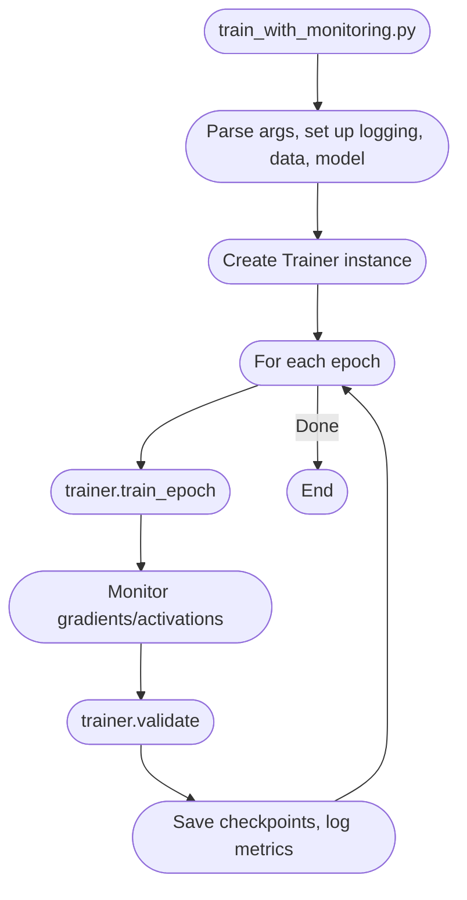
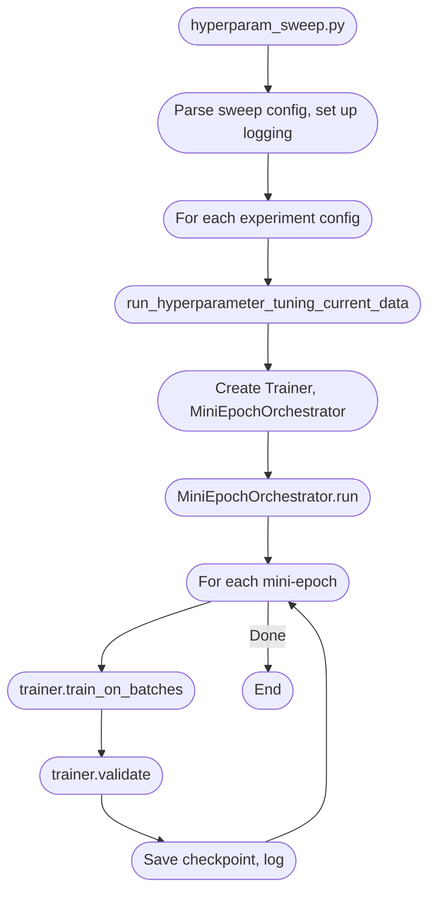

# Duplicate Code in Hex AI Project

This document logs known areas of code duplication in the project, with brief notes on their differences and any important context.

---

## 1. Dataset Classes

### StreamingAugmentedProcessedDataset
- Loads as many files as needed to reach the sample limit, storing all examples in memory.
- Supports random access (`__getitem__`, `__len__`).
- Skips files with errors (logs a warning, continues).
- Used in the original pipeline.

### StreamingSequentialShardDataset
- Loads one shard (file) at a time, yielding examples sequentially (never more than one shard in memory).
- Strictly sequential access (`__iter__` only, no random access).
- Fails loudly on any file error (no silent skipping).
- Designed for large-scale, memory-efficient, and robust streaming.
- More detailed progress logging when `verbose=True`.

**Key difference:**
- The first is for random access and in-memory loading; the second is for streaming, sequential, memory-efficient loading.

---

## 2. Trainer Methods

### Trainer.train
- The original training loop method.
- Handles epochs, batching, and validation internally.
- May be less modular or flexible for advanced orchestration.

### Trainer.train_on_batches
- A newer or alternative training loop.
- Designed for use with mini-epoch orchestrators or more granular control.
- May allow for more flexible interruption, logging, or integration with orchestration logic.

**Key difference:**
- `train` is a monolithic, self-contained loop; `train_on_batches` is more modular and designed for orchestration.

---

## Main Training Flows: Monitoring vs. Hyperparameter Sweep

There are two primary entrypoints for training in the current codebase, each following a distinct flow and using different Trainer methods:

### 1. Monitoring Training Flow (`scripts/train_with_monitoring.py`)

- **Entrypoint:** `scripts/train_with_monitoring.py`
- **Core method:** `Trainer.train_epoch()`
- **Description:**
  - Parses command-line arguments, sets up logging, loads data and model.
  - Instantiates a `Trainer`.
  - For each epoch:
    - Calls `trainer.train_epoch()` to run a full epoch of training.
    - Optionally monitors gradients and activations for debugging.
    - Calls `trainer.validate()` for validation.
    - Saves checkpoints and logs metrics.
  - Repeats for the specified number of epochs.

### 2. Hyperparameter Sweep Flow (`scripts/hyperparam_sweep.py`)

- **Entrypoint:** `scripts/hyperparam_sweep.py`
- **Core method:** `Trainer.train_on_batches()` (via `MiniEpochOrchestrator`)
- **Description:**
  - Parses sweep configuration, sets up logging.
  - For each experiment configuration:
    - Calls `run_hyperparameter_tuning_current_data`, which:
      - Loads data, creates a `Trainer` and a `MiniEpochOrchestrator`.
      - The orchestrator runs training in "mini-epochs" (fixed number of batches per mini-epoch).
      - For each mini-epoch:
        - Calls `trainer.train_on_batches(batches)` for a chunk of batches.
        - Calls `trainer.validate()` for validation.
        - Saves checkpoints and logs metrics.
      - Repeats until all data is processed for the epoch, then continues for the specified number of epochs.

**Key differences:**
- The monitoring flow is simpler and runs full epochs at a time, using the original `train_epoch` method.
- The hyperparameter sweep flow is more modular, running in mini-epochs for finer-grained validation/checkpointing, and uses the newer `train_on_batches` method via an orchestrator.

---

## 3. Inference and CLI Duplication (2025-07-23)

### Potentially Obsolete or Duplicated Inference Code
- `hex_ai/inference/simple_model_inference.py` and `scripts/simple_inference_cli.py`:
  - These files implement custom inference logic and a CLI for model predictions.
  - With the new batch inference and model loading code (`hex_ai/inference/model_wrapper.py` and `scripts/infer_on_training_batch.py`), these may be redundant or outdated.
  - The new code provides a more robust, testable, and batch-oriented approach, and is likely to supersede the old scripts.
  - **TODO:** Review these files for deletion or refactoring after confirming the new pipeline is correct and complete.

### Other Observed Duplication
- Model loading and inference logic is now centralized in `ModelWrapper`, but older scripts and utilities may still use custom or legacy code paths.
- Data preprocessing for inference vs. training should be unified; any remaining custom preprocessing in scripts or utilities should be reviewed for consolidation. 

---

## 4. Player identification code: BLUE / RED, constants and enums
 - We've tried to make the BLUE / RED distinctions with both
   - the constants in hex_ai/config.py
   - and the utilities and enums in hex_ai/value_utils.py

Need to decide on a single system.

---

## 5. We have both
- extract_training_examples_from_game -- currently a dead code path
- extract_training_examples_with_selector_from_game -- used to get final_move training set.

## Other code cleanup

- There are multiple places (e.g. forward in hex_ai/training.py, create_augmented_example_with_player_to_move in hex_ai/data_utils.py) where manual preprocessing of examples (adding player-to-move channel, policy label conversion, etc.) is repeated. Now that preprocess_example_for_model exists in hex_ai/data_utils.py, update all such code to use this utility for consistency and maintainability.
- Audit other scripts, training, and data pipeline code for similar duplicate logic and refactor to use the central utility where possible.
- Currently the test suite doesn't pass, this needs to be cleaned up.

**Note:**
- These duplications may be temporary as the codebase is modernized and refactored. This document should be updated as further consolidation or cleanup occurs. 

---

## 3. StreamingSequentialShardDataset __len__ Hack (Technical Debt)

- **File:** hex_ai/data_pipeline.py
- **What:** The class now implements a dummy __len__ that returns a large value (10**12) and logs a warning.
- **Why:** PyTorch DataLoader (and/or some library code) calls __len__ on IterableDataset, even though this is not correct for streaming datasets. This hack is a workaround to allow training to proceed.
- **Risks:** Any code that relies on the dataset length will get a nonsense value. This could affect progress bars, batch counting, or other logic. Remove this hack as soon as PyTorch or the codebase no longer requires it.
- **Action:** Remove this workaround and restore strict streaming semantics when possible. 
