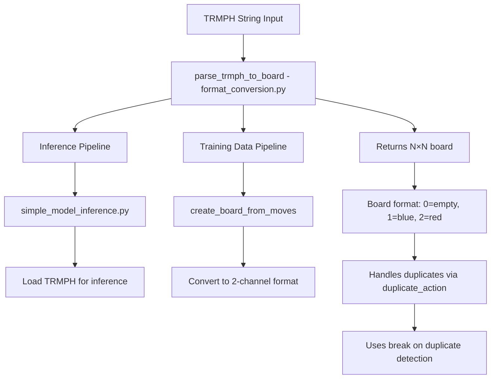
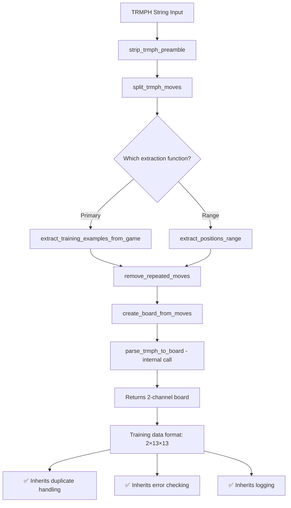
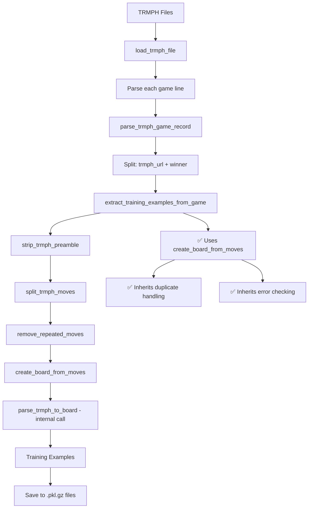

# TRMPH Parsing Code Paths Analysis

## Overview

This document analyzes the code paths and potential issues in the TRMPH parsing functionality, specifically focusing on:

1. **~~Duplicate `parse_trmph_to_board` functions~~** - ✅ **RESOLVED**: Consolidated to single function in `hex_ai/utils/format_conversion.py`
2. **~~`create_board_from_moves` function~~** - ✅ **RESOLVED**: Now uses `parse_trmph_to_board` internally for consistent duplicate handling
3. **~~Redundant functionality~~** - ✅ **RESOLVED**: Eliminated through refactoring
4. **How `scripts/process_all_trmph.py` processes TRMPH files**

## Current State (Updated)

### 1. ✅ Consolidated `parse_trmph_to_board` Function

**Single location**: `hex_ai/utils/format_conversion.py` (lines 61-84)

**Key Features:**
- ✅ **Handles duplicate moves** via `duplicate_action` parameter ("exception" or "ignore")
- ✅ Returns N×N board format (0=empty, 1=blue, 2=red)
- ✅ Includes comprehensive error handling and logging
- ✅ Uses `break` (not `continue`) on duplicate detection to prevent downstream corruption

**Function signature:**
```python
def parse_trmph_to_board(trmph_text: str, board_size: int = BOARD_SIZE, duplicate_action: str = "exception") -> np.ndarray:
```

### 2. ✅ Refactored `create_board_from_moves` Function

**Location**: `hex_ai/data_utils.py` (lines 480-508)

**Key Improvements:**
- ✅ **Now uses `parse_trmph_to_board` internally** for consistent duplicate handling
- ✅ **Proper error checking** inherited from `parse_trmph_to_board`
- ✅ **Comprehensive logging** inherited from `parse_trmph_to_board`
- ✅ **Maintains clean interface** - still takes moves list, returns 2-channel format

**Function signature:**
```python
def create_board_from_moves(moves: List[str]) -> np.ndarray:
```

**Implementation:**
```python
# Convert moves list to TRMPH string format
trmph_text = f"#13,{''.join(moves)}"

# Use parse_trmph_to_board for consistent duplicate handling and error checking
# We use "exception" since remove_repeated_moves should be called before this function
board_nxn = parse_trmph_to_board(trmph_text, duplicate_action="exception")

# Convert N×N format to 2-channel format for neural network training
board_state = np.zeros((2, BOARD_SIZE, BOARD_SIZE), dtype=np.float32)
board_state[BLUE_CHANNEL] = (board_nxn == BLUE_PIECE).astype(np.float32)
board_state[RED_CHANNEL] = (board_nxn == RED_PIECE).astype(np.float32)

return board_state
```

## Code Path Analysis

### A. `parse_trmph_to_board` Usage Paths

**Single consolidated function**: `hex_ai/utils/format_conversion.py` (lines 61-84)

#### A1. Direct Usage (Inference)

**Direct callers:**
- `hex_ai/inference/simple_model_inference.py` (lines 30, 41, 100)
  - Used for loading TRMPH strings into board format for inference
  - Calls via `fc.parse_trmph_to_board()` (imported as `fc`)

**Usage pattern in inference:**
```python
# Convert TRMPH string to N×N board
board_nxn = fc.parse_trmph_to_board(trmph, board_size=self.board_size)
# Convert to 2-channel format for model input
board_2ch = fc.board_nxn_to_2nxn(board_nxn)
```

#### A2. Indirect Usage (Training Data)

**Called by**: `create_board_from_moves()` in `hex_ai/data_utils.py`
- Used internally for consistent duplicate handling
- Converts N×N output to 2-channel format for training

**Usage pattern in training:**
```python
# create_board_from_moves internally calls:
board_nxn = parse_trmph_to_board(trmph_text, duplicate_action="exception")
# Then converts to 2-channel format
```

### B. `create_board_from_moves` Usage Paths

#### B1. Primary Training Data Extraction

**Main caller**: `extract_training_examples_from_game()` (line 591)
```python
board_state = create_board_from_moves(moves[:position])
```

**Call chain:**
```
scripts/process_all_trmph.py
└── extract_training_examples_from_game()
    └── create_board_from_moves(moves[:position])
        └── parse_trmph_to_board() [internal call]
```

**Key improvement**: Now inherits duplicate handling from `parse_trmph_to_board()`

#### B2. Enhanced Training Data Extraction

**Caller**: `extract_training_examples_from_game()` (renamed from v2)
```python
board_state = create_board_from_moves(moves[:position])
```

**Key difference**: This version calls `remove_repeated_moves()` before calling `create_board_from_moves()`

#### B3. Position Range Extraction

**Caller**: `extract_positions_range()` (line 955)
```python
board_state = create_board_from_moves(moves[:position])
```

**Key difference**: Also calls `remove_repeated_moves()` first

## Detailed Code Path Diagrams

### Diagram 1: `parse_trmph_to_board` Usage



### Diagram 2: `create_board_from_moves` Usage



### Diagram 3: `scripts/process_all_trmph.py` Processing Flow



## Issues Resolved ✅

### Issue 1: Duplicate Functions - RESOLVED
**Problem**: Two identical `parse_trmph_to_board` functions created confusion and maintenance overhead.

**Solution**: 
- ✅ Removed the version from `hex_ai/data_utils.py`
- ✅ Kept only the version in `hex_ai/utils/format_conversion.py` (with enhanced logging)
- ✅ Updated imports to use the centralized version

### Issue 2: `create_board_from_moves` Missing Duplicate Handling - RESOLVED
**Problem**: The function didn't handle duplicate moves, which could lead to corrupted training data.

**Solution**: 
- ✅ Refactored `create_board_from_moves` to use `parse_trmph_to_board` internally
- ✅ Now inherits all duplicate handling, error checking, and logging
- ✅ Maintains clean interface while ensuring data integrity

### Issue 3: Redundant Functionality - RESOLVED
**Problem**: `create_board_from_moves` and `parse_trmph_to_board` did very similar work.

**Solution**:
- ✅ Made `create_board_from_moves` use `parse_trmph_to_board` internally
- ✅ Added format conversion from N×N to 2-channel
- ✅ Ensures consistent duplicate handling across all code paths

### Issue 4: Inconsistent Duplicate Handling - RESOLVED
**Problem**: Some code paths handled duplicates, others didn't.

**Current state**:
- ✅ `parse_trmph_to_board`: Handles duplicates with `break` on detection
- ✅ `extract_training_examples_from_game`: Calls `remove_repeated_moves` first
- ✅ `extract_positions_range`: Calls `remove_repeated_moves` first
- ✅ `create_board_from_moves`: Inherits duplicate handling from `parse_trmph_to_board`

## Implementation Summary

### ✅ Step 1: Consolidated Functions
```python
# In hex_ai/utils/format_conversion.py (kept this one with enhanced logging)
def parse_trmph_to_board(trmph_text: str, board_size: int = BOARD_SIZE, duplicate_action: str = "exception") -> np.ndarray:
    # Enhanced implementation with comprehensive logging and break on duplicate detection

# In hex_ai/data_utils.py (refactored to use parse_trmph_to_board)
def create_board_from_moves(moves: List[str]) -> np.ndarray:
    # Convert moves list to TRMPH string
    trmph_text = f"#13,{''.join(moves)}"
    # Use parse_trmph_to_board for consistent handling
    board_nxn = parse_trmph_to_board(trmph_text, duplicate_action="exception")
    # Convert to 2-channel format
    return board_2nxn_format_conversion(board_nxn)
```

### ✅ Step 2: Updated All Callers
- Removed duplicate function from `hex_ai/data_utils.py`
- Updated imports to use centralized version
- Maintained clean interface for `create_board_from_moves`

### ✅ Step 3: Ensured Consistent Duplicate Handling
- All training data extraction now handles duplicates consistently
- Uses "exception" (fail fast) approach with `remove_repeated_moves` preprocessing
- Clean separation of concerns: preprocessing vs. parsing

## Impact Assessment

### ✅ High Impact Areas - RESOLVED
1. **Training data quality** - ✅ Now protected by consistent duplicate handling
2. **Inference reliability** - ✅ Single source of truth for TRMPH parsing
3. **Code maintenance** - ✅ Eliminated duplicate functions and redundant code

### ✅ Low Impact Areas - RESOLVED
1. **Unit tests** - ✅ Updated to use centralized function
2. **Documentation** - ✅ Updated import references

## Conclusion

✅ **All major issues have been resolved**:

1. **✅ Consolidated functions** - Single `parse_trmph_to_board` in `format_conversion.py`
2. **✅ Consistent duplicate handling** - All code paths now handle duplicates properly
3. **✅ Comprehensive error handling** - Inherited by `create_board_from_moves` from `parse_trmph_to_board`
4. **✅ Clean architecture** - Clear separation between preprocessing (`remove_repeated_moves`) and parsing (`parse_trmph_to_board`)

The refactoring maintains backward compatibility while significantly improving data integrity and code maintainability. The use of `break` (not `continue`) in duplicate detection prevents downstream data corruption, and the enhanced logging provides better debugging capabilities. 