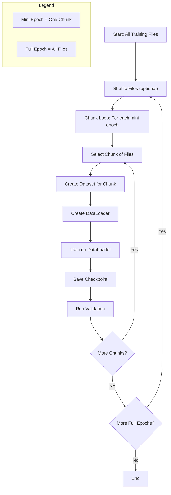

# Training with Mini Epochs: Design and Implementation

## Motivation

When training on very large datasets (e.g., 97M examples across 500 files), a single epoch can take a long time. For robustness, monitoring, and the ability to recover from interruptions, it's desirable to:
- Save intermediate checkpoints during a single pass over the data
- Run validation and early stopping checks more frequently than once per full epoch
- Keep the data pipeline and training loop simple, robust, and compatible with standard PyTorch practices

## Design Principles

- **Finite Dataset:** Each dataset instance represents a finite set of samples (augmented or unaugmented). No automatic restart or infinite streaming.
- **Mini Epochs:** Divide the full dataset into manageable chunks ("mini epochs"), each consisting of a subset of files. Each mini epoch is a full pass over its chunk.
- **Chunked Training Loop:** The training loop iterates over mini epochs, creating a new dataset and DataLoader for each chunk.
- **Checkpointing:** Save model checkpoints at the end of each mini epoch (or after a fixed number of batches, if desired).
- **Validation:** Run validation and early stopping checks at mini epoch boundaries or at any desired interval.
- **Shuffling:** Shuffle the list of files at the start of each full epoch to ensure randomness.
- **Separation of Concerns:** The dataset is responsible only for providing samples; the training loop manages epochs, checkpointing, and validation.

## Workflow

1. **Prepare the list of data files** (e.g., 500 files).
2. **Shuffle** the list at the start of each full epoch (optional, but recommended).
3. **Divide** the list into chunks (mini epochs), e.g., 20 files per chunk.
4. **For each mini epoch:**
    - Create a new dataset and DataLoader for the chunk
    - Train for one pass over the chunk (mini epoch)
    - Save a checkpoint
    - Run validation
5. **Repeat** until all files have been processed (one full epoch), then reshuffle and repeat as desired.

### Workflow Visualization

The following flowchart illustrates the overall process of mini-epoch training, checkpointing, and validation:



## Pseudocode Example

```python
all_files = get_all_training_files()
chunk_size = 20  # Number of files per mini epoch
num_epochs = 10  # Number of full passes over the data

for epoch in range(num_epochs):
    random.shuffle(all_files)  # Shuffle files for each full epoch
    for chunk_start in range(0, len(all_files), chunk_size):
        chunk_files = all_files[chunk_start:chunk_start+chunk_size]
        dataset = StreamingAugmentedProcessedDataset(chunk_files, ...)
        dataloader = DataLoader(dataset, ...)
        train_on_dataloader(dataloader)
        save_checkpoint(epoch, chunk_start)
        run_validation()
```

## Implementation Suggestions

- **Dataset Construction:**
    - The dataset should be constructed with only the files for the current mini epoch.
    - No need for the dataset to handle epoch restarts or infinite streaming.
- **DataLoader:**
    - Use standard PyTorch `DataLoader` for batching and shuffling within the chunk.
- **Checkpointing:**
    - Save model state, optimizer state, and any relevant metadata (e.g., current epoch, chunk index).
    - Use a consistent naming scheme for checkpoint files (e.g., `checkpoint_epoch{epoch}_chunk{chunk_start}.pt`).
- **Validation:**
    - Run validation after each mini epoch, or after a fixed number of batches.
    - Use a separate validation dataset (not included in the training chunks).
- **Resuming Training:**
    - To resume, load the latest checkpoint and continue from the appropriate epoch/chunk.
- **Logging:**
    - Log progress, losses, and validation metrics at each mini epoch boundary.

## Benefits

- **Robustness:** Frequent checkpoints reduce risk of data loss.
- **Monitoring:** More frequent validation allows for better tracking of overfitting and model performance.
- **Simplicity:** The data pipeline and training loop are easy to understand and debug.
- **Scalability:** Works for any dataset size; can be parallelized or distributed if needed.
- **Standard Practice:** Compatible with PyTorch and other ML frameworks.

## Example: Checkpoint Naming

```python
def save_checkpoint(epoch, chunk_start):
    checkpoint_path = f"checkpoints/checkpoint_epoch{epoch}_chunk{chunk_start}.pt"
    torch.save({
        'model_state_dict': model.state_dict(),
        'optimizer_state_dict': optimizer.state_dict(),
        'epoch': epoch,
        'chunk_start': chunk_start,
        # ... any other metadata ...
    }, checkpoint_path)
```

## Future Extensions

- **Dynamic Data:** If new data files are generated during training, update the file list at the start of each full epoch.
- **Distributed Training:** Assign different chunks to different workers for parallel training.
- **Adaptive Chunk Size:** Adjust chunk size based on available memory or compute resources.

---

This design document should serve as a reference for implementing and maintaining robust, scalable, and standard-compliant training workflows for large datasets. 